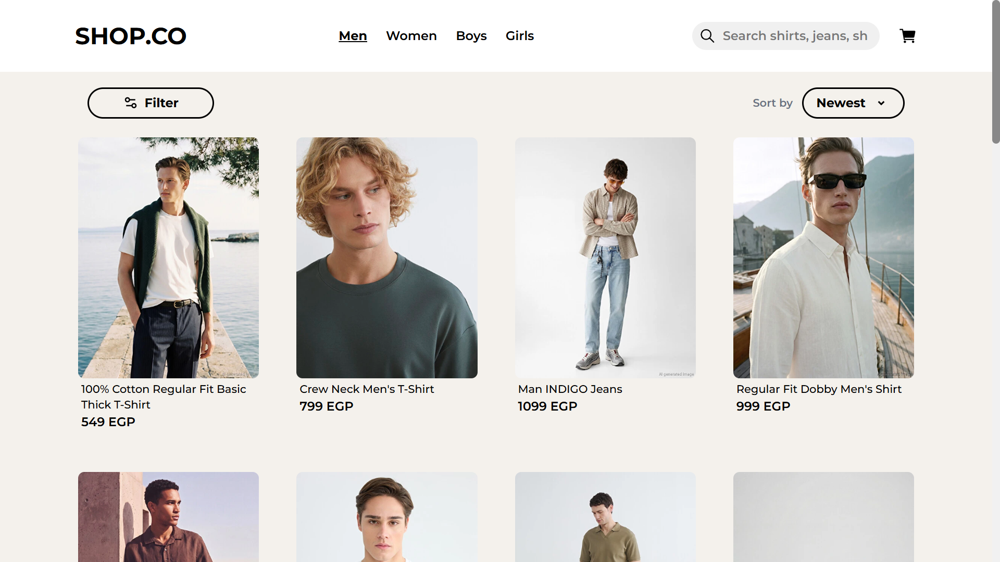

# 🛍️ Shop.co - E-commerce Website

A modern, responsive e-commerce web application built with **React** and **Vite**, inspired by a professional Figma design. The project simulates a real online shopping experience with real product data, advanced filtering, cart management, and a complete checkout flow.

## 🌐 Live Demo

🔗 https://y0usefsobhy.github.io/Shop.co/#/

## 📷 Screenshots

### Homepage

<!-- Replace with your image path -->


### Products Page

<!-- Replace with your image path -->


---

## ✨ Features

- 🛍️ Browse products with real product data
- 🔍 Search products by name
- 🎯 Filter by:
  - Category
  - Brand
- ↕️ Sort products
- 📄 Dynamic product details page
- 🛒 Shopping cart
- 💾 Cart persistence using Local Storage
- 💳 Complete checkout flow with a fake payment gateway
- 📱 Fully responsive design
- ⚡ Fast performance with Vite
- ♻️ Reusable React components
- 🚦 Client-side routing with React Router
- 🔄 State management using Redux Toolkit

---

## 🚀 Tech Stack

- React
- Vite
- Redux Toolkit
- React Router
- Tailwind CSS
- Material UI
- JavaScript (ES6+)
- Baserow (REST API)

---

## 📊 Data Source

Instead of using mock data, this project uses **real product information**.

The workflow was:

1. Scraped product data from a real e-commerce website.
2. Cleaned and organized the dataset.
3. Stored the data in **Baserow**.
4. Consumed the data through the **Baserow REST API**.

This approach provides a more realistic shopping experience compared to static JSON files.

---

## 🎨 UI Design

The interface was developed from a community Figma design:

https://www.figma.com/design/APeem5AEhSuBOn5mJ7LXw5/E-commerce-Website-Template--Freebie---Community-

The goal was to recreate the design while ensuring responsiveness and a smooth user experience.

---

## 📂 Project Structure

```text
src/
│
├── components/
├── pages/
├── layouts/
├── redux/
├── hooks/
├── services/
├── utils/
├── assets/
└── App.jsx
```

---

## ⚙️ Installation

Clone the repository

```bash
git clone https://github.com/Y0usefSobhy/Shop.co.git
```

Navigate to the project

```bash
cd Shop.co
```

Install dependencies

```bash
npm install
```

Start the development server

```bash
npm run dev
```

Build for production

```bash
npm run build
```

---

## 📸 Future Improvements

- ❤️ Wishlist
- 👤 User authentication
- 📦 Order history
- ⭐ Product reviews
- 💳 Real payment gateway integration
- 🌙 Dark mode
- 🔔 Notifications

---

## 👨‍💻 Author

**Yousef Sobhy**

- GitHub: https://github.com/Y0usefSobhy
- LinkedIn: https://www.linkedin.com/in/yousef-sobhy-3978a2262/

---

## ⭐ If you like this project

Give it a ⭐ on GitHub if you found it useful!
